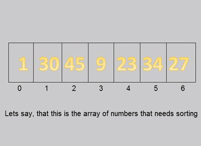
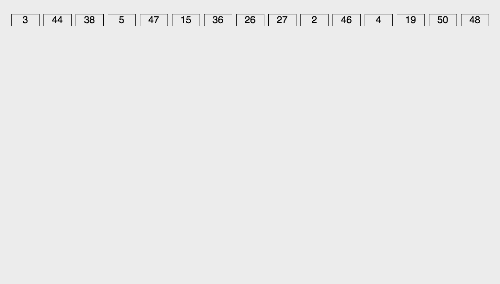
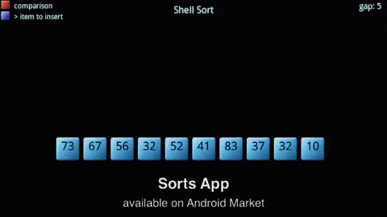
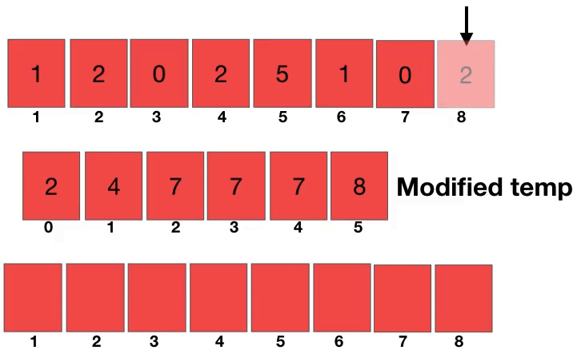

# 

  
  
  

 

# 🎰 Métodos de Ordenação 

Este repositório apresenta uma variedade de algoritmos de ordenação, com o objetivo de fornecer uma visão geral dos métodos mais comuns utilizados para organizar elementos em uma lista. Cada algoritmo de ordenação abordado neste documento possui suas próprias características, complexidade e eficiência, o que pode influenciar a escolha da abordagem mais adequada para diferentes situações.
  
Os seguintes métodos de ordenação serão explorados em detalhes:

  - 1️⃣ Bubble Sort;
  - 2️⃣ Bucket Sort;
  - 3️⃣ Selection Sort;
  - 4️⃣ Insertion Sort;
  - 5️⃣ Merge Sort;
  - 6️⃣ Heap Sort;
  - 7️⃣ Radix Sort;
  - 8️⃣ Shell Sort;
  - 9️⃣ Counting Sort;
  - 🔟 Quick Sort;  

Espera-se que essa compilação seja útil para entender os diferentes métodos de ordenação e escolher a abordagem mais apropriada para suas necessidades.

## 1️⃣ Bubble Sort

- Algoritmo simples
- **Como funciona:**
  - Percorre repetidamente a lista, comparando pares de elementos adjacentes e trocando-os caso estejam na ordem errada
  - Esse processo é repetido até que a lista esteja completamente ordenada
- **Complexidade de tempo:** O(n2)
- **Desvantavem:** Ineficiente para grandes conjuntos de dados

 

<em>Gif 1: Gif esquemático do funcionamento do método.</em>

<!--

 

<em>Gif 2: Gif gráfico do funcionamento do método.</em>

-->
## 2️⃣ Bucket Sort

- **Como funciona:**
- Divide o intervalo de valores em intervalos menores, chamados de "baldes", e distribui os elementos nos baldes correspondentes.
- Em seguida, os elementos em cada balde são ordenados individualmente, geralmente usando outro algoritmo de ordenação.
- Por fim, os elementos são concatenados na ordem correta.
- **Complexidade de tempo:** O(n+k), onde n é o número de elementos e k é o número de baldes
- **Vantagem:** Eficiente quando os elementos de entrada são distribuídos de maneira uniforme
- **Desvantavem:** Ineficiente para grandes conjuntos de dados
  

 

<em>Gif 3: Gif esquemático do funcionamento do método.</em>

<!--

 

<em>Gif 4: Gif gráfico do funcionamento do método.</em>

-->
## 3️⃣ Selection Sort

- Algoritmo simples
- **Como funciona:**
  - Divide a lista em duas partes: uma parte ordenada e outra desordenada
  - A cada iteração, o algoritmo encontra o menor elemento na parte desordenada e o coloca no final da parte ordenada
  - Isso é repetido até que a lista inteira esteja ordenada
- **Complexidade de tempo:** O(n2)
- **Desvantavem:** Ineficiente para grandes conjuntos de dados

 

<em>Gif 5: Gif esquemático do funcionamento do método.</em>

<!--

 

<em>Gif 6: Gif gráfico do funcionamento do método.</em>

-->
## 4️⃣ Insertion Sort;

- **Como funciona:**
- Constrói uma lista ordenada um elemento de cada vez, inserindo cada novo elemento na posição correta.
- Percorre a lista, comparando cada elemento com os elementos anteriores e movendo-os uma posição para a direita, se necessário. 
- **Complexidade de tempo:** O(n2)
- **Vantagem:** Eficiente para pequenos conjuntos de dados ou quando a lista já está quase ordenada
- Seu desempenho é melhor que o **Bubble Sort** e o **Selection Sort** em muitos casos.

 

<em>Gif 7: Gif esquemático do funcionamento do método.</em>

<!--

 

<em>Gif 8: Gif gráfico do funcionamento do método.</em>

-->
## 5️⃣ Merge Sort;

- Princípio de **"Divisão e Conquista"**
- **Como funciona:**
  - Divide a lista em duas metades, ordena cada metade separadamente e depois mescla as duas metades em uma única lista ordenada
  - Esse processo é repetido recursivamente até que a lista esteja completamente ordenada.
- **Complexidade de tempo:** O(n log n)
- **Vantagem:** Boa opção para grandes conjuntos de dados.

 

<em>Gif 9: Gif esquemático do funcionamento do método.</em>

<!--

 

<em>Gif 10: Gif gráfico do funcionamento do método.</em>

-->
## 6️⃣ Heap Sort;

- **Como funciona:**
  - Constrói uma árvore binária completa, chamada de heap, em que cada nó é maior ou igual aos seus filhos
  - O maior elemento é colocado na raiz da árvore e, em seguida, removido e colocado na posição correta
  - Esse processo é repetido até que a lista esteja completamente ordenada
- **Complexidade de tempo:** O(n log n) em todos os casos.

 

<em>Gif 11: Gif esquemático do funcionamento do método.</em>

<!--

 

<em>Gif 12: Gif gráfico do funcionamento do método.</em>

-->
## 7️⃣ Radix Sort;

- **Como funciona:**
  - Ordena os elementos com base nos dígitos menos significativos para os mais significativos
  - Usa uma técnica chamada "ordenação estável", o que significa que a ordem relativa dos elementos com o mesmo dígito é preservada durante o processo.
- **Complexidade de tempo:** O(d * (n + k)), onde d é o número de dígitos, n é o número de elementos e k é o intervalo dos valores
- **Vantagem:** Classificação de elementos que têm uma representação fixa, como números inteiros.
  

 

<em>Gif 13: Gif esquemático do funcionamento do método.</em>

## 8️⃣ Shell Sort; 

- Variação do **Insertion Sort** que melhora sua eficiência
- **Como funciona:**
  - Divide a lista em subgrupos menores e aplica o Insertion Sort a cada um desses subgrupos
  - Gradualmente, os subgrupos se tornam maiores até que a lista inteira seja ordenada
- **Complexidade de tempo:** Depende do intervalo utilizado
- Geralmente é melhor que o Bubble Sort, o Selection Sort e o Insertion Sort.
  

 

<em>Gif 15: Gif esquemático do funcionamento do método.</em>

<!--

 

<em>Gif 16: Gif gráfico do funcionamento do método.</em>

-->
## 9️⃣ Counting Sort;

- **Como funciona:**
  - Cria um vetor de contagem para contar o número de ocorrências de cada valor na lista de entrada
  - Em seguida, ele determina as posições corretas de cada elemento na lista ordenada usando a contagem acumulada
- **Complexidade de tempo:** O(n+k), onde n é o número de elementos e k é o intervalo dos valores.
- **Vantagem:** Classificação de elementos quando o intervalo dos valores é pequeno
  

 

<em>Gif 17: Gif esquemático do funcionamento do método.</em>

<!--

 

<em>Gif 18: Gif gráfico do funcionamento do método.</em>

-->
## 🔟 Quick Sort; 

- Paradigma de "Conquista e Divisão"
- **Como funciona:**
  - Escolhe um elemento chamado "pivô" da lista e reorganiza os elementos
  - De forma que todos os elementos menores que o pivô estejam à sua esquerda, e todos os elementos maiores estejam à sua direita
  - Em seguida, é aplicado recursivamente às duas sublistas geradas à esquerda e à direita do pivô
- **Complexidade de tempo:** Média de O(n log n), mas pode degradar para O(n2) no pior caso
- **Vantagem:** Classificação de grandes massas de dados
  

 

<em>Gif 19: Gif esquemático do funcionamento do método.</em>

<!--

 

<em>Gif 20: Gif gráfico do funcionamento do método.</em>

-->
